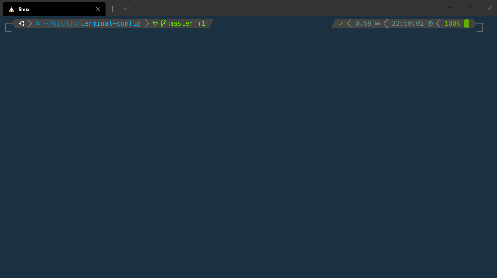
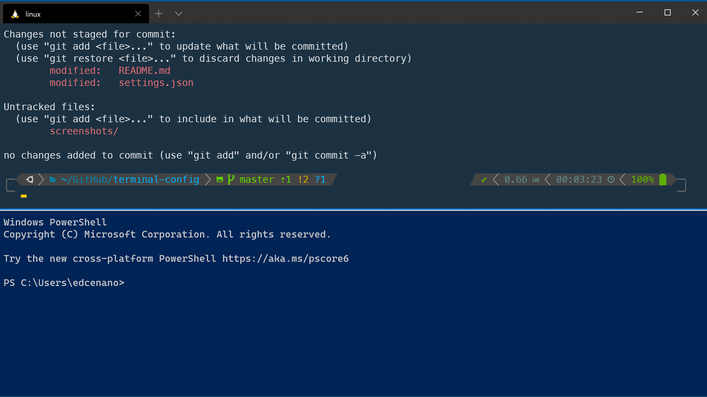
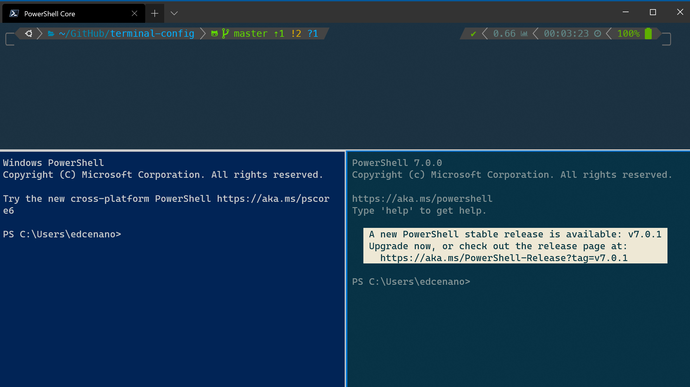

# Windows Terminal with WSL2 and zsh

The new Windows Terminal has a lot of new cool capabilities, like multiple tabs, panes, Unicode and UTF-8 character support, a GPU accelerated text rendering engine and much more. Combining it with WSL2, zsh shell and powerlevel10k brings the terminal experience to a whole new level. 



## Installation and configuration
1. Install [WSL2](https://docs.microsoft.com/en-us/windows/wsl/install-win10)
2. Install [Windows Terminal](https://github.com/microsoft/terminal/releases)

I used a modified version of the ```One Half Dark``` color scheme. For my complete configuration check the [```settings.json```](settings.json) file. 

3. Install oh-my-zsh

Once Windows Terminal is installed run
```
sudo apt-get install zsh
```
To install oh-my-zsh run
```
sh -c "$(curl -fsSL https://raw.githubusercontent.com/ohmyzsh/ohmyzsh/master/tools/install.sh)"
```
Restart the terminal for the changes to take effect

4. Install [Meslo Nerd Font](https://github.com/romkatv/powerlevel10k#meslo-nerd-font-patched-for-powerlevel10k)

5. Install and configure Powerlevel10k

[Powerlevel10k](https://github.com/romkatv/powerlevel10k) is a theme for zsh with loads of customizations. To install it run
```
git clone --depth=1 https://github.com/romkatv/powerlevel10k.git $ZSH_CUSTOM/themes/powerlevel10k
```
Edit ```~/.zshrc``` and change ```ZSH_THEME``` to
```
ZSH_THEME="powerlevel10k/powerlevel10k"
```
To get the same look like in my screenshots simply copy the content of my [```.zshrc```](.zshrc) and [```.p10k.zsh```](.p10k.zsh) files.

For a completely new configuration run the wizard
```
p10k configure
```

## Screenshots
Horizontal split pane with PowerShell



WSL2, PowerShell and PowerShell Core all in one terminal 


## Questions
Please use GitHub issues or contact me on twitter [@ecenanovic](https://twitter.com/ecenanovic)